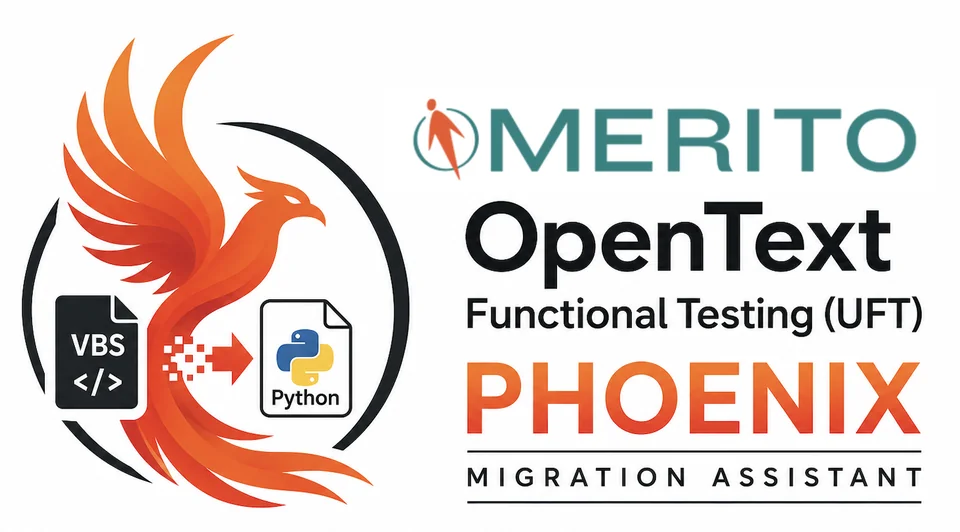

<!--
  Generated from the UFT Phoenix source repository by sync_to_github.py.
  Do not edit this repository by hand: every publish replaces its contents.
-->

  

<h3 align="center">Convert OpenText UFT One tests from VBScript to Python — safely, at enterprise scale.</h3>

  
  
  
  
  
  
  

  <a href="https://merito-solutions.github.io/uft-phoenix-docs/"><strong>Read the documentation »</strong></a>
  &nbsp;·&nbsp;
  <a href="https://www.merito.com/resources/downloads/merito-uft-phoenix-vbs-to-python-utility?utm_source=other&utm_medium=referral&utm_campaign=merito-uft-phoenix-vbs-to-python-utility-5100009">Request access</a>
  &nbsp;·&nbsp;
  <a href="https://www.merito.com/book-consultation?utm_source=other&utm_medium=referral&utm_campaign=merito-uft-phoenix-vbs-to-python-utility-5100009">Talk to Merito</a>

---

VBScript is on Microsoft's deprecation path, and OpenText UFT One now runs
tests written in Python. **Merito UFT Phoenix** converts your existing
VBScript GUI tests into genuine UFT Python tests, so years of automation
investment carries forward instead of being rewritten by hand.

- **Two ways to convert.** A folder of tests on disk, or a whole OpenText
  Application Quality Management (ALM) project converted in place.
- **Safe by design.** A read-only analysis first, a confirmed backup before
  any write, and an all-or-nothing gate that never leaves a project half
  converted.
- **Built for real estates.** Tests that call each other's shared actions
  are converted together, and version history is kept on version-controlled
  projects.

To request access to UFT Phoenix, use the
[request access](https://www.merito.com/resources/downloads/merito-uft-phoenix-vbs-to-python-utility?utm_source=other&utm_medium=referral&utm_campaign=merito-uft-phoenix-vbs-to-python-utility-5100009) link.

## Documentation

The full documentation is published at **[https://merito-solutions.github.io/uft-phoenix-docs/](https://merito-solutions.github.io/uft-phoenix-docs/)**.

**Getting Started**

| Guide | What it covers |
| --- | --- |
| [Installation](https://merito-solutions.github.io/uft-phoenix-docs/install/) | Prerequisites, the Windows installer (interactive and silent) and the environment check. |
| [Usage](https://merito-solutions.github.io/uft-phoenix-docs/usage/) | Both conversion paths — a local folder of tests or a whole ALM project — end to end. |
| [Supported Versions](https://merito-solutions.github.io/uft-phoenix-docs/supported_versions/) | Supported Windows, UFT One and ALM versions, and exactly what converts. |

**Using the Console**

| Guide | What it covers |
| --- | --- |
| [Console Field Guide](https://merito-solutions.github.io/uft-phoenix-docs/gui_field_guide/) | Every screen, field and button of the Migration Console, in wizard order. |
| [Migration Playbook](https://merito-solutions.github.io/uft-phoenix-docs/playbook/) | The enterprise engagement sequence, phase by phase, with exit criteria. |
| [Acceptance Test Plan](https://merito-solutions.github.io/uft-phoenix-docs/acceptance_test_plan/) | A hands-on validation walkthrough with a sign-off matrix. |

**Safety & Operations**

| Guide | What it covers |
| --- | --- |
| [ALM Safety](https://merito-solutions.github.io/uft-phoenix-docs/alm_safety/) | The write-safety model, everything a conversion writes to ALM, and how rollback works. |
| [Blocker Remediation](https://merito-solutions.github.io/uft-phoenix-docs/remediation/) | How to fix each blocker that keeps a test from converting. |
| [Troubleshooting](https://merito-solutions.github.io/uft-phoenix-docs/troubleshooting/) | Diagnosing environment, conversion and upload problems. |
| [Advanced Troubleshooting](https://merito-solutions.github.io/uft-phoenix-docs/advanced_troubleshooting/) | Deep diagnostics for support engineers and migration leads. |
| [Known Limitations](https://merito-solutions.github.io/uft-phoenix-docs/limitations/) | What Phoenix does not do, and the constructs that need a human. |

## Let Merito lead your migration

Phoenix is built by [Merito](https://www.merito.com), specialists in
OpenText functional testing and quality management. Our consultants can lead
a UFT migration end to end: planning, pilots, blocker remediation, rollout
and team enablement.

[Book a consultation](https://www.merito.com/book-consultation?utm_source=other&utm_medium=referral&utm_campaign=merito-uft-phoenix-vbs-to-python-utility-5100009) · [Get a quote](https://www.merito.com/get-a-quote?utm_source=other&utm_medium=referral&utm_campaign=merito-uft-phoenix-vbs-to-python-utility-5100009)

## About this repository

This repository publishes the customer documentation for UFT Phoenix
1.1.2. UFT Phoenix itself is proprietary software of Merito Solutions,
Inc., and its source code is not published here. The software is licensed
under the agreement in [LICENSE](LICENSE), the same one the installer shows.
The documentation is © Merito Solutions, Inc., all rights reserved — see
[LICENSE-DOCS.md](LICENSE-DOCS.md).

This repository is generated automatically, so pull requests and issues are
not monitored. For questions, [contact Merito](https://www.merito.com/book-consultation?utm_source=other&utm_medium=referral&utm_campaign=merito-uft-phoenix-vbs-to-python-utility-5100009).
